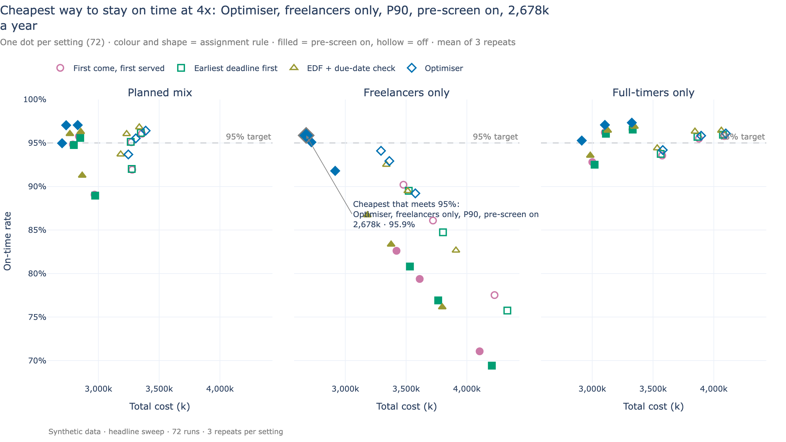

# Scout Capacity Planner

A scenario simulator for a fictional football scouting agency that promises
clubs a scouting report within 14 days while demand grows 4x in a year. It
generates a synthetic world, forecasts demand, plans hiring, assigns work every
day with one of four rules (from first-come-first-served to a CP-SAT
optimiser) and simulates the year day by day, from a Streamlit app with a
background worker or from the command line. All data is synthetic.



**Optimised assignment vs FCFS — results, method and limits, written for a
business reader: [docs/OPTIMISATION_CASE_STUDY.md](docs/OPTIMISATION_CASE_STUDY.md)**

## Results at a glance

Each setting is simulated for 3 full years with different luck; costs are in
an invented currency, "k" = thousands per year. Every number comes from
[`docs/img/key_numbers.md`](docs/img/key_numbers.md), generated by `make charts`.

- **On identical data, the optimiser beats first-come-first-served (FCFS) by
  +5.0 points of on-time rate and -6.6% total cost on average** across 18
  staffing settings at 4x growth, and is better on both in 12 of 18. The gain
  grows as capacity tightens (correlation -0.97 with FCFS's on-time rate), up
  to +20.7 points and -28.9% cost.
- **A constraint-aware heuristic gets part of the way:** EDF + due-date check
  gains +1.9 points and -2.7% over FCFS (better on both in 15 of 18); the
  optimiser beats it by +3.0 points and -4.1% on average, but not everywhere
  (it loses with the tool off at the default plan, and under severe
  under-hiring).
- **The cheapest way to meet 95% at 4x** is the optimiser with freelancers-only
  hiring, a P90 plan and the video pre-screen tool on: 2,678k, against 2,840k
  for the cheapest FCFS setting that passes (-5.7%). The optimiser meets 95%
  in 11 of 18 settings, FCFS in 7.
- **Operational levers matter as much as the rule:** assigning daily instead
  of weekly adds 28.3 points; hiring for 2x when 4x arrives drops on-time to
  53–65% and adds 1,882k; with no hiring at all the best setting reaches 37%.

The case study explains these results, how the comparison is made fair, and
where the optimiser does not win.

## System overview

The core is a *batch pipeline* (the "pipes and filters" pattern): five pure
stages, each a module with one input and one output. `run_pipeline(params)`
runs them for one parameter set and writes one run folder. Everything else
(app, worker, CLI, sweeps, charts) is a shell around that one function.

```
 config/default.yaml + overrides ──► Params (pydantic, validated, schema_version)
                                        │
   ┌────────────────────────────────────┴───── run_pipeline(params) ──────────────┐
   │ [1] generate ─► [2] forecast ─► [3] capacity plan ─► [5] simulate            │
   │  synthetic       log-ETS ×        max-flow coverage     day by day, N seeds   │
   │  world           assumed growth   + hiring table        in a process pool;    │
   │  (actual growth)                                        calls [4] assign      │
   │                                                         every day             │
   └────────────────────────────────────┬─────────────────────────────────────────┘
                                        ▼
                    data/runs/<run_id>/  params.yaml · status.json · raw/ ·
                                         forecast · plans · results/ · summary.json
          ▲ writes "queued"             ▲ executes (one at a time)    ▲ executes
   ┌──────┴───────┐              ┌──────┴──────────┐            ┌─────┴──────────┐
   │ Streamlit app│              │ worker          │            │ CLI: make run, │
   │ (never runs  │◄─ reads ─────│ (supervisor +   │            │ make sweep     │
   │  a pipeline) │              │  child process) │            │ (same lock)    │
   └──────────────┘              └─────────────────┘            └─────┬──────────┘
                                                                      ▼ --publish
                 data/published/<sweep>_summary.parquet ──► make charts ──► docs/img/
```

## Components in depth

### Configuration (`config.py`, `config/default.yaml`)

Every number that matters is a parameter, catalogued in
[`docs/PARAMETERS.md`](docs/PARAMETERS.md) and validated by pydantic models
(ranges, cross-field rules such as "every work item fits one full-timer's
window"). Params files start with a `schema_version` and are migrated on load
(`config.migrate`); duplicate YAML keys are rejected; dotted overrides
(`assignment.policy=optimiser`) deep-merge into groups. A run is fully
described by its `params.yaml`.

### [1] Synthetic world (`generate.py`)

`generate_world(params)` builds about 40 scouts (60/40 full-time/freelance)
with 1–4 of 15 skill types (position x invented region x language), league
fixture calendars with breaks, and 48 months of request history plus the
simulated year. Requests arrive as a daily Poisson process with
transfer-window seasonality; 15% are express (7-day turnaround), which is what
makes earliest-deadline-first differ from first-come-first-served (D-025).

- **Calibration against a fixed reference team (D-003, D-018).** Base volume is
  chosen so the *default* team starts the year at 70% of usable hours. It is
  calibrated once, not per run; otherwise "add 10 freelancers" would raise
  demand to keep load at 70% and cancel the what-if. A test checks the
  realised start load.
- **Thinning (D-019).** Future arrivals are drawn at the highest growth rate
  and each is kept with probability rate / ceiling using its own pre-drawn
  uniform (*Lewis–Shedler thinning*). The 2x world's requests are an exact
  subset of the 4x world's, so growth comparisons differ only by the extra
  requests.
- **Per-entity streams (D-015, D-026).** Each scout draws its attributes from
  a stream keyed by its stable id (`FT001`, `FL001`), and outcomes such as
  "this request's pre-screen fails" are pre-drawn per request. Adding scouts
  never reshuffles existing ones.
- **Common random numbers.** Together, these make two runs that differ in one
  parameter share everything else: same requests, team, leave and luck. The
  stream machinery lives in `rng.py` (`numpy.random.SeedSequence`, one child
  per purpose, keyed by replication and name).

### [2] Forecast (`forecast.py`)

`build_forecast(requests, params)` reads history rows only (a test changes the
actual growth and expects an identical forecast: no *leakage*).

- **Log-ETS.** ETS(A,Ad,A) from statsmodels on log monthly counts, which makes
  seasonality multiplicative; the additive version under-forecast the January
  peak (D-023). All-additive ETS has exact prediction intervals, so no
  simulation is needed. Seasonal-naive fallback if a fit fails.
- **Growth overlay (D-005, D-020).** A model cannot learn a 4x ramp that has
  not started. For the plan year the ETS trend is *replaced* by the assumed
  growth (multiplying both would count organic growth twice).
- **Top-down by skill.** Per-skill series are small, noisy counts, so each
  skill gets the aggregate x its trailing-12-month share.
- **Backtest.** Rolling origin over the history (at least 24 months of
  training, 12-month horizon), scored by WAPE against each skill's seasonal
  naive. `make forecast` prints the table.
- **Calibrated quantiles (D-023).** The planning quantile (P80 by default) adds
  level, Poisson arrival, skill-share and hours-per-request variance; a
  multi-seed test checks its coverage. The first version's "P80" covered
  about 56%.

### [3] Capacity plan (`plan.py`)

`build_capacity_plan(...)` compares required hours (the planning quantile)
with what the team can supply, per skill and month, and writes a hiring table.

- **Min-cost max-flow coverage (D-023).** A network source -> scout -> each
  skill the scout holds -> sink (OR-Tools `SimpleMinCostFlow`) finds the true
  shortfall per skill. A fixed split of each scout's hours invented
  "phantom gaps" (at half today's demand it still hired 14 people).
- **Hiring triggers.** Shortfalls are judged on deseasonalised requirements: a
  persistent gap becomes full-time hires sized to the base load (3-month lead
  time); a peak-only gap becomes freelancers sized to the peak (1-month lead
  time); freelancers bridge until full-timers join. Small gaps under a quarter
  of a full-timer's month are ignored.
- **Hire mixes (D-028).** `rule` (the above), `freelance_only` and
  `full_time_only` are what-if plans for the headline sweep.
- Hires join the simulated team when the plan says they would, so "planned
  for 2x, got 4x" plays out in the simulation (D-014: actual and assumed
  growth are separate parameters).

### [4] Assignment engine (`assign/`)

Four policies behind one interface, `assign(items, scouts, window, rng, *, cost)`,
registered in `assign/__init__.py:POLICIES` (the *strategy pattern*: adding a
policy is one registry entry):

| Policy | File | Idea |
|---|---|---|
| `fcfs` | `greedy.py` | oldest request first |
| `edf` | `greedy.py` | earliest due date first |
| `edf_feasible` (default) | `greedy.py` | EDF, but a scout only takes an item if everything they hold still finishes by its due date |
| `optimiser` | `optimiser.py` | CP-SAT decides the whole day's pool at once |

- **Shared hard constraints (`eligibility.py`).** Skill match, conflict of
  interest, precedence, live-view date and region, and hours are defined once.
  `validate_assignments()` re-checks any policy's answer, and the tests run it
  on every policy's output.
- **Greedy rules** are *list-scheduling* heuristics: sort once, give each item
  to the salaried-first, least-loaded eligible scout. Deliberately naive.
- **The optimiser** is a CP-SAT model with variables only for eligible pairs,
  due-date-aware capacity per scout and day, and an objective that prices
  lateness, freelance hours, hand-overs and plan changes. It runs
  deterministically with a warm start from EDF + due-date check. The full
  model, how it was debugged, and when it pays off are in the
  [case study](docs/OPTIMISATION_CASE_STUDY.md).

### [5] Simulation (`simulate.py`, `pipeline.py`)

`simulate_replication(inputs)` is a pure *time-stepped* simulation: a plain
loop over calendar days (no discrete-event library), so invariants are easy to
test. Each day, in order: weekly bookkeeping (backlog snapshot, progress,
cancel check) -> arrivals -> re-target live views whose match passed ->
assignment run (on cadence days) -> execution (today's live views, then time
in lieu, then each scout's queue: started work first, then earliest due).

- **Rolling horizon with a frozen zone (D-010).** Each assignment run looks 7
  days ahead; started work never moves. Assignment runs daily, weekends
  included (D-024); a weekly cadence is a parameter.
- **Time in lieu.** A weekend live view's 8 hours are repaid from the scout's
  next working days.
- **Rework (D-029).** A failed pre-screen means the desk review costs its full
  hours in total plus an overhead, the same rule the capacity plan uses; a
  cross-module test pins plan and simulation together.
- **Censoring.** Requests due after the simulated year are not scored;
  unfinished scored requests count as late.
- **Replications vary luck, not decisions (D-024).** Team, fixtures, forecast
  and plan are fixed per run; arrivals, durations, leave and freelancer hours
  are redrawn per replication. Replications run in a `ProcessPoolExecutor`
  with the `spawn` start method (forking a process that holds CP-SAT threads
  can deadlock); progress flows back over a queue, cancellation out over an
  event.

### Experiment infrastructure (`runs.py`, `worker.py`, `sweep.py`, `cli.py`)

- **Run folders are the job queue (D-013).** "Run" in the app writes
  `data/runs/<run_id>/params.yaml` and `status.json` (queued). No broker, no
  database: the run store is the only module that touches these files.
- **Atomic writes.** Status files are written to a temp file and swapped in
  with `os.replace`; new runs are assembled in a staging folder and renamed
  into place, so a reader never sees half a run.
- **A state machine as data.** `queued -> running -> done | failed | cancelled`,
  enforced by `runs.update_status` (illegal transitions raise).
- **Supervisor and child.** The worker never runs a simulation itself: each run
  executes in a child process that leads its own process group. If the child
  dies without recording a final state (crash, out of memory) the worker marks
  it failed; a cancel the child ignores is enforced by killing the group.
- **Heartbeat and lock.** The worker rewrites `_worker.json` every poll (the app
  warns if it goes stale) and holds an `flock` on `_worker.lock`, which the OS
  releases however the process dies. On start, leftover `running` runs become
  `failed (interrupted)`.
- **Poison pill.** A run the worker cannot even start (unwritable folder) is
  skipped for the life of the process, so one bad folder cannot stop the queue.
- **Executor lease.** The CLI takes the same lock and heartbeat
  (`worker.executor_lease`), so only one executor runs at a time: `make run`
  refuses while the app's worker is running (`make sweep` can hand its runs
  to the worker with `--queue`).
- **Sweeps.** A YAML file with `vary` (full factorial), `fixed` and `link`
  (e.g. "assumed growth = actual growth", so no runs are wasted on unwanted
  combinations) expands into ordinary runs sharing a `sweep_id`. `--publish`
  flattens them into `data/published/<sweep>_summary.parquet`, refusing
  partial grids unless `--allow-partial`, and publishes solver diagnostics
  (fallbacks, solve statuses) next to the metrics (D-029).

### Simulator app (`app/`)

A five-page Streamlit app: Sweep results, New run, Runs, Run detail, Compare.

- **Rerun model.** Streamlit re-executes the page script on every interaction,
  which is why runs live in the worker, not the session.
- **Fragments.** Only the "In progress" part of the Runs page refreshes itself
  every 2 seconds (`st.fragment(run_every="2s")`), so the rest of the page
  does not jump.
- **URL state.** The selected run (`?run=<id>`) and compared runs (`?runs=...`)
  live in the URL, so a reload or a shared link shows the same view.
- **View-model split.** `app/viewmodel.py` holds every decision (labels,
  validation messages, diff and metric tables) as plain functions with no
  Streamlit import, unit-tested without a browser; `app/ui.py` and
  `app/views/` only render. A test enforces that app code never imports the
  pipeline stages.

### Charts pipeline (`charts.py`, `readme_charts.py`, `scripts/make_readme_charts.py`)

Plotly figures shared by the app and the README. README charts are built from
the published summaries; each title is an *action title* computed from the
data, and the same script writes `key_numbers.md`, so prose and charts cannot
drift from the numbers. PNG export uses kaleido, which needs a local Chrome.

## Engineering practice

- **Tests.** About 980 fast tests and 60 slow end-to-end tests (counting
  parametrised cases) in a fast suite
  (`make test`, about 1 minute) and a slow end-to-end suite (`make test-all`,
  about 7 minutes). They include:
  - *invariant oracles*: no scout over hours, write-up never before its
    prerequisites, every policy's output passes `validate_assignments`;
  - *metamorphic and common-random-number tests*: more capacity never lowers
    on-time rate, changing only the policy leaves arrivals identical, a lower
    growth's requests are a subset of a higher one's;
  - *determinism*: same seed gives byte-identical generated data, and the
    same `params.yaml` gives an identical run, for the optimiser too;
  - *boundary and edge cases*: a full run with zero freelancers, zero
    full-timers, a single scout, worst-case rework, every request urgent,
    overload and more, each checked against every invariant;
  - *end to end*: CLI runs, worker crash recovery with real processes,
    Streamlit `AppTest` pages, a fresh-clone setup test, and checks that the
    Makefile targets exist and the quick sweep stays small.
- **Three red-team reviews** (D-021, D-023, D-029) found and fixed: an
  optimiser objective that rewarded "assigned" instead of "on time"; a late
  penalty that did not affect assignment; a "P80" that covered 56%; phantom
  capacity gaps; rework charged twice in the simulation; and an unfair
  baseline (the optimiser was compared against a heuristic missing the
  due-date check it enforced). Each fix has a test.
- **Determinism.** Independent random streams per purpose; CP-SAT
  single-threaded with a deterministic work limit instead of a wall-clock
  limit; inputs sorted on entry so list order cannot change answers.
- **Guardrail as code (D-002).** A word-list check (`guardrail.py`, with
  inflection and prefix matching) scans tracked files, paths and commit
  messages through a test and a `commit-msg` hook. The list itself is
  untracked, so hits are reported masked and the check skips cleanly on a
  fresh clone.
- **Docs as contracts.** [`DATA_CONTRACTS.md`](docs/DATA_CONTRACTS.md) fixes
  every table schema and the run-folder layout; [`PARAMETERS.md`](docs/PARAMETERS.md)
  is the spec for `config.py`; [`DECISIONS.md`](docs/DECISIONS.md) logs
  D-001 to D-030, each with the rejected alternative.
- **Functional core, imperative shell.** Stages are pure functions; file I/O
  lives only in `runs.py`, the CLI and the app.

## Tech stack

Python 3.12 managed by uv; pandas, numpy, pyarrow (parquet); pydantic and
PyYAML (parameters); statsmodels (ETS); OR-Tools (CP-SAT, min-cost flow);
plotly and kaleido (charts); Streamlit (app); pytest and ruff. The worker and
queue use only the standard library (`multiprocessing`, `fcntl`, `os.replace`).

## Run it

Requires [uv](https://docs.astral.sh/uv/), which installs Python 3.12.

```bash
make setup     # install the locked environment, enable the git hooks
make app       # app + background worker at http://localhost:8501 (Ctrl-C stops both)
```

| Command | What it does |
|---|---|
| `make test` | fast suite, about 1 minute (includes the guardrail check) |
| `make test-all` | adds slow end-to-end tests, about 7 minutes |
| `make all` | tests, lint, the five stages on the dev run, then the quick sweep (a few minutes) |
| `make run PARAMS=config/default.yaml` | one run into `data/runs/`, executed now |
| `make sweep SWEEP=quick` | expand `config/sweeps/quick.yaml` into runs and execute them |
| `make sweep SWEEP=headline SWEEP_ARGS=--publish` | re-run the headline sweep (about an hour) and publish it |
| `make charts` | README charts and `key_numbers.md` from `data/published/` (needs a local Chrome) |

Only one executor at a time: `make run` and `make sweep` refuse while the
app's worker is running on the same runs folder; stop `make app` first, or
use `SWEEP_ARGS=--queue` to hand a sweep to the worker. The published
summaries are committed, so the Sweep results page and `make charts` work on
a fresh clone without re-running anything.

On macOS, `/usr/bin/make` needs the Xcode licence accepted
(`sudo xcodebuild -license`), or use GNU make (`brew install make`, then
`gmake`). Every target is a thin wrapper, so `uv run` works directly:
`uv sync --locked`, `uv run pytest -m "not slow"`,
`uv run python -m scout_planner.serve`.

## Project structure

```
scout-capacity-planner/
├── config/
│   ├── default.yaml          # default value of every parameter
│   └── sweeps/               # headline, growth, forecast_error, baseline, cadence, late_penalty, quick
├── src/scout_planner/
│   ├── config.py             # pydantic parameter models, migration, overrides
│   ├── domain.py             # Scout, Request, Task, WorkItem, Fixture (frozen dataclasses)
│   ├── rng.py                # named random streams (common random numbers)
│   ├── generate.py           # [1] synthetic world
│   ├── forecast.py           # [2] log-ETS, backtest, quantiles
│   ├── plan.py               # [3] max-flow coverage, hiring triggers
│   ├── assign/               # [4] eligibility + validator, greedy rules, CP-SAT optimiser
│   ├── simulate.py           # [5] day-by-day simulation of one replication
│   ├── metrics.py, results.py
│   ├── pipeline.py           # run_pipeline: stages + process pool
│   ├── runs.py               # run store: folders, state machine, atomic writes
│   ├── worker.py             # supervisor, child processes, lock, lease
│   ├── sweep.py, cli.py      # sweeps, publishing, command line
│   ├── serve.py              # `make app`: worker + Streamlit together
│   ├── charts.py, readme_charts.py, formatting.py
│   └── guardrail.py          # vocabulary check (test + commit-msg hook)
├── app/
│   ├── main.py               # navigation, sidebar, queue indicator
│   ├── ui.py, viewmodel.py   # components / pure view logic
│   └── views/                # sweep, new_run, runs, run_detail, compare
├── scripts/                  # README chart export, demo runs
├── data/published/           # committed sweep summaries
├── docs/                     # design docs, case study, README images
└── tests/
```

## Limitations

- **Synthetic data.** Seasonality, skill mix and durations are invented and
  stable; real feeds need data contracts, validation at the boundary and
  monitoring for forecast drift.
- **Model simplifications.** Hires are single-skilled; per-skill P80 hours are
  summed, which ignores pooling and likely over-hires; a live view always costs
  a full 8-hour day in the scout's home region; task hours are known once
  drawn; scouts never leave; the year starts with an empty backlog.
- **Assignment.** Once a day, no re-assignment within a day; no scout
  preferences or fairness over weeks; the optimiser's per-decision budget is
  small (0.3 s in the sweeps), which limits it on very deep backlogs (see the
  case study).
- **Product scope.** Single user, local only, no authentication, no
  integration with hiring systems; the hiring table is an output to read.
- `make` on macOS needs the Xcode licence or GNU make (see above).

## Docs

- [`docs/OPTIMISATION_CASE_STUDY.md`](docs/OPTIMISATION_CASE_STUDY.md): optimised assignment vs FCFS.
- [`docs/PRD.md`](docs/PRD.md): goal, scope, acceptance criteria.
- [`docs/ARCHITECTURE.md`](docs/ARCHITECTURE.md): engine, app, worker, modelling.
- [`docs/DATA_CONTRACTS.md`](docs/DATA_CONTRACTS.md): run folder, status file, schemas.
- [`docs/PARAMETERS.md`](docs/PARAMETERS.md): every input with its default.
- [`docs/DECISIONS.md`](docs/DECISIONS.md): decisions D-001 to D-030 and why.
- [`docs/NEXT_STEPS.md`](docs/NEXT_STEPS.md): status and open questions.
- [`docs/img/key_numbers.md`](docs/img/key_numbers.md): every published number.

## Licence

MIT, see [LICENSE](LICENSE).
