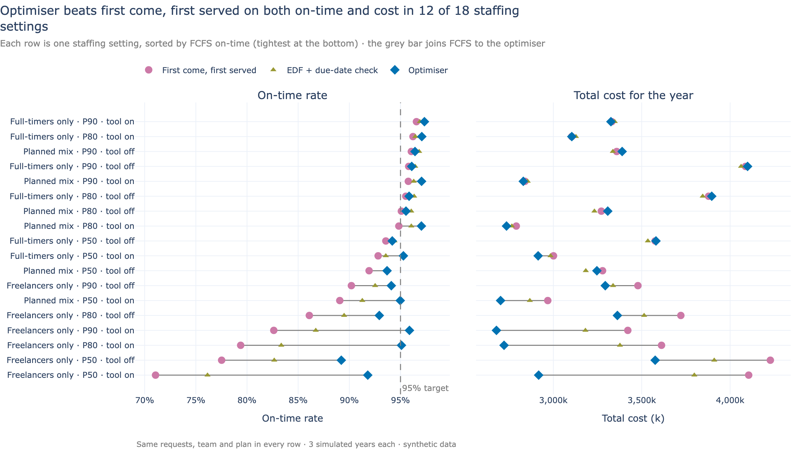
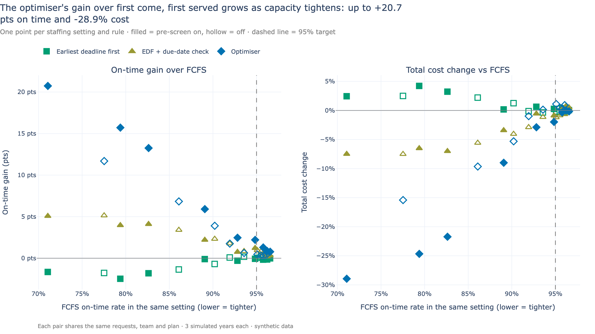
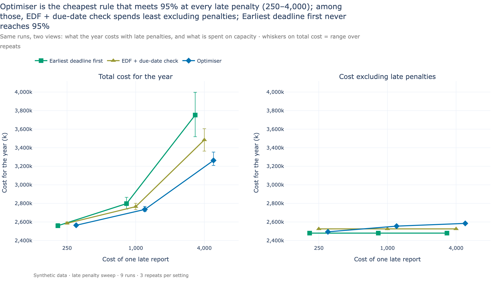

# Optimised assignment vs first-come-first-served: a case study

**Summary.** A fictional football scouting agency must deliver reports within
14 days while demand grows 4x in a year. I simulated the full year, day by day,
under four assignment rules on identical data. A constraint-programming
optimiser beat first-come-first-served (FCFS) on both on-time rate and cost in
12 of 18 staffing settings, and its advantage grew as the team got busier.

| Optimiser vs FCFS, 18 staffing settings at 4x growth | Result |
|---|---|
| On-time rate | **+5.0 points** on average (median +2.0, up to +20.7) |
| Total cost for the year | **-6.6%** on average (median -1.5%, up to -28.9%) |
| Settings meeting the 95% on-time target | **11 of 18**, against 7 of 18 for FCFS |
| Cheapest setting that meets 95% | **2,678k**, against 2,840k for FCFS (-5.7%) |



*Each row is one staffing setting: the same requests, team and hiring plan
for every rule. The grey bar joins FCFS (pink) to the optimiser (blue). Rows
are sorted with the tightest operations at the bottom, which is where the
bars are longest.*

All data is synthetic. Costs are in an invented currency ("k" = thousands per
year). Every result is generated from the published sweeps into
[`img/key_numbers.md`](img/key_numbers.md); the development history comes
from the project's decision log, [`DECISIONS.md`](DECISIONS.md).

## The problem in business terms

The agency's scouts are a skilled, distributed workforce. Each report needs a
desk review of video, sometimes a live match visit, and a write-up, in that
order. What makes assignment hard:

- **Deadlines differ.** Most reports are due in 14 days, express ones in 7.
- **Skills are scarce.** A request needs a scout who covers its position,
  region and sometimes language; some skills have only two or three holders.
- **Some work happens on fixed dates.** A live view must happen at a specific
  match, in the scout's region, and takes their whole day.
- **People cost differently.** A salaried scout's hours are already paid; a
  freelancer costs 1.5x per hour but only for the hours used.
- **Lateness is expensive.** A late report costs 1,000 in refunds and lost
  goodwill, about 2.5x the labour cost of the report itself.
- **Conflicts of interest.** A scout may not report on a former club.

Every day, someone decides which scout does which task. Get it wrong and work
sits in the wrong queue, scarce skills are spent on work others could do, or
freelancers are paid for hours a salaried scout had free. The same structure
appears wherever skilled people are assigned to deadline-bound jobs.

## Four rules, from naive to optimised

| Rule | How it decides | What it ignores |
|---|---|---|
| **First come, first served (FCFS)** | Oldest request first, to the least-loaded eligible scout (salaried first) | Deadlines |
| **Earliest deadline first (EDF)** | Most urgent request first, same scout choice | Whether the scout can actually finish it in time |
| **EDF + due-date check** | EDF, but a scout only takes a task if everything they already hold still finishes on time | Everything beyond the next task: it never reconsiders |
| **Optimiser (CP-SAT)** | Looks at all open work and all scouts at once and searches for the cheapest plan | Nothing in the model, but it has a time budget per decision |

The first three are *greedy* rules: they decide one task at a time and never
look back. They are fast and easy to explain, and they make mistakes such as
spending a rare multi-skilled scout on work anyone could do. EDF + due-date
check is the *strong baseline*: a simple rule given the same feasibility test
the optimiser uses. An optimiser should be judged against the best simple
rule, not only the weakest one.

All four share the same hard rules (skills, conflicts, match dates, hours),
written once, and one checker validates every rule's output in the tests.

## How the comparison is made fair

A result like "+5 points" only means something if the rule is the only thing
that changed.

- **Equal data.** Every random draw comes from its own seeded stream: request
  arrivals, task durations, leave, freelancer availability and whether each
  pre-screen fails. Changing the rule changes none of them, so each pair of
  runs sees the same requests, the same team, the same hiring plan and the
  same luck. This is the *common random numbers* technique, and tests check
  it (changing only the rule leaves arrivals identical).
- **Many conditions, not one.** 18 staffing settings: three hiring mixes
  (the plan's own blend, freelancers only, full-timers only) x three levels
  of planning caution x the video pre-screen tool on or off. Each setting is
  simulated for 3 full years with different luck.
- **A full simulation, not a toy instance.** Each year runs day by day: about
  40 scouts growing through planned hires, 15 skill types, league match
  calendars with breaks, rework when the pre-screen fails, leave and weekends. The rule is
  called every morning on whatever work is open.
- **Reproducible.** Same parameters give the same results, including the
  optimiser's (it runs single-threaded on a deterministic work limit).

## Results

### Paired comparison against FCFS

| Rule vs FCFS (18 settings) | On-time gain, mean (median) | Cost change, mean (median) | Better on both |
|---|---|---|---|
| Earliest deadline first | -0.5 pts (-0.1) | +0.9% (+0.3%) | 6 of 18 |
| EDF + due-date check | +1.9 pts (+1.1) | -2.7% (-1.2%) | 15 of 18 |
| **Optimiser** | **+5.0 pts (+2.0)** | **-6.6% (-1.5%)** | **12 of 18** |

Plain EDF is no better than FCFS: sorting by deadline without checking whether
the deadline can be met does not help. The due-date check is where the simple
rule gains. Head to head, the optimiser beats EDF + due-date check by +3.0
points and -4.1% cost on average, and on both measures in 12 of 18 settings.

### The gain grows as capacity tightens



The optimiser's on-time gain correlates at -0.97 with FCFS's own on-time rate:
the more a setting struggles, the more there is to gain from smarter
assignment. Where FCFS already delivers about 95%, the optimiser adds a point
or less. In the tightest setting (freelancers only, P50 plan, tool on), where
FCFS falls to about 71%, the optimiser adds +20.7 points and cuts total cost
by 28.9%.

### Meeting the target, and at what cost

| Rule | Settings meeting 95% | Cheapest passing setting | vs FCFS |
|---|---|---|---|
| First come, first served | 7 of 18 | 2,840k | |
| Earliest deadline first | 7 of 18 | 2,851k | +0.4% |
| EDF + due-date check | 8 of 18 | 2,765k | -2.6% |
| **Optimiser** | **11 of 18** | **2,678k** | **-5.7%** |

The optimiser makes more staffing plans viable, including the cheapest one
(freelancers only, cautious plan, tool on). That plan is on the edge: with any
other rule it misses the target.

### With and without the pre-screen tool

| Optimiser vs FCFS | On-time gain | Cost change | Better on both |
|---|---|---|---|
| Tool on (9 settings) | +7.0 pts | -10.0% | 8 of 9 |
| Tool off (9 settings) | +2.9 pts | -3.2% | 4 of 9 |

The tool makes desk work shorter but less predictable (15% of its outputs
fail and must be redone), and the optimiser's lead is clearly larger with it.
The data shows why: the hiring plan counts on the tool's time saving and hires
fewer people (on average about 29 full-timers and 41 freelancers instead of 39
and 54), so tool-on settings are tighter: FCFS averages 88.7% on time with
the tool against 91.3% without. Tighter settings are exactly where smarter
assignment pays (previous section). With the tool off, the median cost change
is +0.1%: in 5 of 9 settings the optimiser buys a little more on-time rate at
equal or slightly higher cost.

### Sensitivity to the price of lateness



At 250, 1,000 and 4,000 per late report, the optimiser is the cheapest rule
that meets 95% at every level. Its advantage grows with the penalty: at 4,000
it costs 3,263k against 3,484k for EDF + due-date check (-221k). At 250 the
two are within 21k, and the optimiser's worst simulated year dips to 94.94%.
Plain EDF never reaches 95% in this sweep.

### Where the optimiser does not win

- **When capacity is comfortable** the gains are small (from +0.3 points) and
  cost can be up to 1.1% higher than FCFS.
- **With the tool off at the default plan**, EDF + due-date check is better and
  cheaper: 96.1% at 3,232k against 95.5% at 3,308k.
- **Under severe under-hiring** (the agency hired for 2x and 4x arrived), EDF +
  due-date check delivers 65.1% on time against the optimiser's 58.9%. The run
  diagnostics explain it: on these deep backlogs 88% of solves ended with a
  feasible plan but no proof of optimality within the 0.3-second budget per
  decision. In the no-hiring stress test the optimiser fell back to the
  heuristic in up to 31% of rounds. The remedy in production is a larger
  budget, splitting the problem by skill or region, or a hybrid (see below).

## How the optimiser works

**In plain words.** Every morning the optimiser looks at all open tasks and
all scouts' free hours for the coming week. It considers every allowed
pairing, and searches for the plan with the lowest total "cost": late reports
priced at what they really cost, freelancer hours at their premium, plus small
charges for handing a report between scouts and for changing yesterday's plan.
It only commits work that will start soon; the rest is re-planned tomorrow
with fresh information. A plan from the strong simple rule is its starting
point, so it always has a good answer and only searches for a better one.

> **Technical summary**
>
> - **Daily rolling horizon.** One CP-SAT model per day over a 7-day window;
>   work already started is frozen.
> - **Decision variables** `x[i, s] ∈ {0,1}` only for eligible scout–task
>   pairs (skill, conflict of interest, precedence, match date and region,
>   availability), pruned in Python before modelling.
> - **Hard constraints.** At most one scout per task; at most one live view per
>   scout per day; **due-date-aware capacity**: for every scout and every day
>   *d* of the window, frozen hours plus assigned work due by *d* must fit the
>   hours available by *d* (the EDF single-machine feasibility condition).
> - **Objective (minimise).** Lateness = late penalty x urgency per *request*
>   (shared across its tasks by hours), with urgency rising as slack shrinks;
>   freelance hours at their premium over salaried hours (salaried hours are a
>   sunk cost); continuity (one scout per request); churn (moving or dropping
>   yesterday's commitment).
> - **Plan long, commit short.** Only work a scout can finish within 2 days of
>   the next run is committed; the rest returns to the pool.
> - **Queue-aware urgency.** A task's slack is reduced by the wait behind
>   earlier-due work of the same skill.
> - **Deterministic search.** Single thread, seeded, deterministic work limit
>   (0.3 s budget per daily decision in the sweeps; mean solve about 0.2 s),
>   full solution hint from EDF + due-date
>   check (*warm start*); falls back to that heuristic if no solution is found.
> - **Runtime.** A median of about 2.6 minutes per run (range 1–7.5 min): 3
>   simulated years in parallel, about 1,100 daily solves in total. The greedy
>   rules take 5–10 seconds per run.
>
> Code: `src/scout_planner/assign/optimiser.py`; shared constraints and the
> validator: `assign/eligibility.py`.

## What it took to get right

The first full-year test was a loss: the optimiser delivered 89% on time
where EDF delivered 97%. It looked good on small test cases and lost in
simulation.

**Root cause.** The model scored finishing a task on day 1 of the window the
same as finishing it on day 6. With no reason to start work early, it parked
work late in the window, and the write-ups that followed lost their buffer.
EDF's least-loaded rule started work early by accident.

**Three fixes, each validated by an ablation sweep** (every combination re-run
against EDF on the same data):

1. commit only work that will be finished soon (*plan long, commit short*);
2. price freelancers at their premium over salaried hours, not the full rate;
3. make urgency aware of the queue in front of each task.

After the fixes the optimiser edged EDF at the default setting (95.5% vs
95.1%). Without the commitment rule it stayed at 93.8%.

**Then the bar was raised.** An adversarial review pointed out that the
optimiser enforced a due-date check that EDF lacked, so part of its "win" was
that constraint, not the search. Giving EDF the same check took about 20
lines, and that heuristic beat the optimiser with the tool off. It became the
project's default rule, and the bar the optimiser has to clear. The results
above are measured against it.

Earlier reviews had already found that the first model rewarded "assigned"
rather than "on time", and that the late penalty did not affect its decisions.
Both were fixed before these results.

## When to use what

| Situation | Use | Why |
|---|---|---|
| Capacity is comfortable | A constraint-aware heuristic (EDF + due-date check) | Gains from optimising are under a point; the heuristic is instant and easy to explain |
| Decisions must be instant or fully explainable | Heuristic | Seconds per simulated year instead of minutes |
| Capacity is tight, constraints many, scarce skills | Optimiser | This is where the +5 to +20 point gains appear |
| Late penalties are high | Optimiser | It prices lateness directly; its advantage grows with the penalty |
| Deep backlogs, large instances, production | Hybrid | Heuristic as the warm start and fallback, optimiser with a larger budget or split by skill or region |

## Limitations and what production would need

- **Real data.** Synthetic requests, durations and calendars stand in for real
  feeds; production needs data contracts and validation at the boundary.
- **Solver budget.** The sweeps used 0.3 seconds per decision. Deep backlogs
  need more time, decomposition by skill or region, or a hybrid.
- **People.** The model ignores scout preferences, fairness over weeks and
  travel fatigue; production would add them as soft constraints.
- **Uncertainty in durations.** Task hours are known once drawn; real work
  overruns, which calls for buffers or re-assignment during the day.
- **Integration.** Live feeds from intake and calendars, and a way for
  managers to override decisions.
- **Monitoring.** Track on-time rate, solver status and fallback rate per
  day, and alert when the solver stops proving good solutions.

## About this project

The assignment engine sits inside a larger build: synthetic data generation,
demand forecasting, capacity planning, a day-by-day simulator, a background
worker and a Streamlit app. The [README](../README.md) covers the whole
system. To reproduce these results:

```bash
make setup
make sweep SWEEP=headline SWEEP_ARGS=--publish   # about an hour
make charts                                      # rebuilds the charts and key_numbers.md
```
